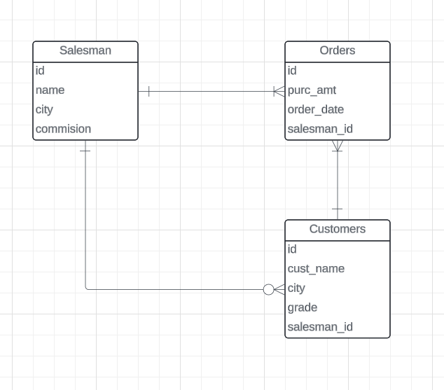

# Entity Relationship Diagram

- given entity name as it is a broad real world term that can be anything
- attributes

- example ERD
- 

TransactionID	Date	ProductName	Category	Price	StoreName	City	Country
1	2024-04-01	Laptop	Electronics	1200	TechWorld	San Francisco	USA
2	2024-04-01	Smartphone	Electronics	800	TechWorld	San Francisco	USA
3	2024-04-02	Jeans	Apparel	40	FashionFiesta	New York	USA
 

- snowflake and star schema